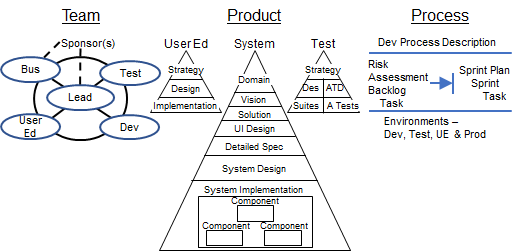

# eRecipeBox Sample App

This repo complements the eBook _How I Built a Business App using Agile w/ Blueprints,_ [available on Amazon](https://www.amazon.com/Built-Business-using-Agile-Blueprints-ebook/dp/B0D99237RB/ref=sr_1_10?crid=8F9NSEQZAPIM&dib=eyJ2IjoiMSJ9.kLLgXG8VJkJ7zpQlBz9g_fbMEDLTQ0fpIULS3iPGb0YFBSMXWYkXdPsUkMq1P62VQNxBPwiVxvy_5QSaOT9jzlCUCsLS__4qOwTEE9NRIalTE2rUOKUSi5On51vllymuwNF0Zjq9TLySKrPUAn0EPB2s0unrHy12rV8XOoc_noJB_PRWKn1bBn417fkZgjLKnpJ5oxJTUsqRk-T4rh7ioWGfeF6vMnF6UazOSEeJi98.LBkwL8892pzeDeO7gxSOwSIXLj8oamV2H9_CVzn1O1k) for $9.99. Agile w/ Blueprints (AwB) is a lightweight yet comprehensive process for building production-quality business applications. Evolved and refined over 20 years by a pragmatic practitioner, it applies proven best practices for small—to medium-sized teams to quickly and efficiently develop software solutions that solve business problems.

The book introduces AwB through a complete, instructional, working example - this eRecipeBox app. [This video](https://www.agilewithblueprints.com/home/#ViewSampleAppVideo) illustrates the app in action. Together, they form the AwB Quick Start. The eBook educates the reader on AwB’s core engineering practices, introduces AwB’s framework, then narrates how the team built eRecipeBox MVP 1.0 over the span of five, one-week sprints. Readers study the sample app while working through the eBook.

[The eRecipeBox downloads page](https://www.agilewithblueprints.com/erecipebox-downloads) provides links to download:

- Installer for eRecipeBox App-Single User: A single user version so users can test drive the app.
- eRecipeBox Source Package: A self-extracting zip containing all eRecipeBox product artifacts and source code, which are the contents of this repo.

_Individuals_ build their skills by enhancing eRecipeBox. In addition, entire AwB _teams_ develop their skills working as a team. Assign members to their AwB role(s) and, together, enhance eRecipeBox over a couple of sprints. In addition to developing individual Agile w/ Blueprints skills, the team as a whole develops its AwB proficiency by establishing a productive culture & communication style of their own.

Agile w/ Blueprints is unique because it's comprehensive, covering all aspects required to develop a business application:

- Business Domain Model
- Product Vision, including ROI & Product Roadmap
- Business Processes & Workflow
- UI Design
- Detailed Requirements
- System Design
- User Education Strategy & Design
- System Test Strategy & Design
- Automated Testing
- Team Structure, Roles & Responsibilities
- Agile Sprint Process
- Project Leadership
- Project Environments (Dev, Test, UE & Production)

This eRecipeBox sample app illustrates how all artifacts integrate and influence each other to develop a business solution efficiently and demonstrates solutions to common challenges when building business apps, such as:

- How to create a risk-driven sprint plan
- How domain & object driven development drive design and implementation
- How to design and implement an app that CRUDs business data
- How to design and implement automated system tests
- How to minimize effort documenting requirements by extracting detailed requirements from source code
- How to use automation to generate large test data sets for stress testing

# Audience

Because the process is comprehensive, the eBook’s target audience is all roles of a project team:

- Executive Sponsors
- Business Users
- Team Leads
- Analysts
- UI Designers
- Architects
- Developers
- Test Architects
- Test Developers
- User Education Architects
- User Education Developers

Team members understand their role and how their project decisions impact other areas of development.

# Repo Contents

This repo contains all eRecipeBox Agile w/ Blueprints artifacts:

All eRecipeBox documentation can be found in …\\eRecipeBoxSystem\\ eRecipeBox\\ Documentation. The eBook and eRecipeBox documentation provide links to instructional videos for key aspects of the process.

Architects, developers, and testers follow steps in the Dev Team Environment section to build their own local dev environment. The remaining team members download and install eRecipeBox App-Single User version so they can test drive the app.

# License

The eRecipeBox sample app and its associated artifacts are licensed under the MIT License.

# How to Contribute and Provide Feedback

If you wish to contribute to eRecipeBox, email [feedback@agilewithblueprints.com](mailto:feedback@agilewithblueprints.com) with your proposal. I welcome all constructive feedback on both eRecipeBox and Agile w/ Blueprints. I invite and encourage anyone to build eRecipeBox using different designs and technologies (Swift, WPF, Python, Web (Vue, React, Blazor, etc.), Flutter/Dart, etc.) so we can compare and contrast approaches.